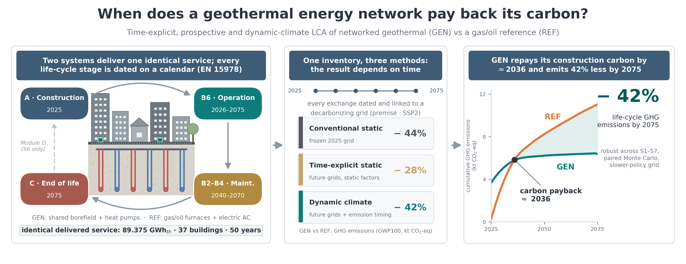

# networked-geothermal-dynamic-lca

**Time-explicit, prospective, and dynamic-climate life-cycle assessment (LCA) of a
networked geothermal energy system (GEN) versus a conventional gas/oil reference (REF).**

[](LICENSE)
[

This repository contains the code, public configuration, derived results, and figures
for the manuscript:

> Ghandi, M., Burek, J., Varela, I. *A prospective and dynamic life-cycle assessment
> framework for the early-design stage of networked geothermal heating in cold
> climates.* In preparation for submission to **Geothermics** (2026).



## What this study does

A geothermal energy network (GEN) front-loads its emissions in construction and then
operates cleanly for decades. This workflow places every life-cycle stage
(EN 15978 A1–A5, B2–B6, C1–C4) on a calendar over 2025–2075, links each dated
exchange to prospective electricity-grid backgrounds
([`premise`](https://github.com/polca/premise), SSP2 pathways), and evaluates one
inventory under three temporal formulations — conventional static, time-explicit
static, and dynamic climate — for the 37-building Framingham (MA) utility pilot.
Headline result: GEN reduces life-cycle GHG emissions by 44 % / 28 % / 42 % under
the three methods and repays its construction carbon by ≈ 2036.

Built on the [Brightway 2.5](https://docs.brightway.dev) ecosystem:
[`bw_temporalis`](https://github.com/brightway-lca/bw_temporalis) (emission timing) and
[`bw_timex`](https://github.com/brightway-lca/bw_timex) (time-explicit background relinking).

## Repository structure

```
├── scripts/b6/       LCA pipeline (Brightway 2.5), run as python -m scripts.b6.<name>
├── config/           public case configuration (fuel shares, archetypes, B6 case, robustness)
├── data/derived/     final derived result tables (CSV) — enough to reproduce every figure
├── figures/          publication figures (PDF + 300-dpi PNG)
│   └── scripts/      standalone scripts that rebuild all main figures from data/derived
└── docs/             step-by-step reproduction guide and data documentation
```

## Quick start — reproduce the figures (no license required)

```bash
git clone https://github.com/Mahsaghandi1993/networked-geothermal-dynamic-lca.git
cd networked-geothermal-dynamic-lca
pip install pandas numpy matplotlib
python figures/scripts/make_results_figures.py     # Figs. 5–10 of the manuscript
python figures/scripts/make_case_figures.py        # Figs. 3–4
python figures/scripts/make_si_borefield_figure.py # Supplementary Fig. S4
python figures/scripts/make_graphical_abstract.py
```

All main results figures regenerate from `data/derived/` in under a minute.

## Full pipeline — reproduce the LCA (licenses required)

The complete Brightway pipeline is in `scripts/b6/` and documented step by step in
[`docs/REPRODUCING.md`](docs/REPRODUCING.md). It requires a **licensed
ecoinvent 3.9.1 (cutoff)** database and `premise`-generated prospective backgrounds,
which we cannot redistribute.

## What is and is not shared

| Included in this repository | Not shareable (and why) |
|---|---|
| All pipeline code (BSD 3-Clause) | ecoinvent 3.9.1 database (commercial license) |
| Public case configuration (fuel shares, B6 case, robustness settings) | `premise` background databases derived from ecoinvent (same license) |
| Final derived result tables (CSV) | Raw Eversource/Framingham building & operational data (confidentiality agreement) |
| All manuscript figures + scripts to rebuild them | Local Brightway project directories (contain licensed data) |

Details in [`docs/DATA.md`](docs/DATA.md). Aggregated, non-confidential derivatives
in `data/derived/` are sufficient to verify and reuse every number reported in the
manuscript. Further information is available from the corresponding author upon
reasonable request.

> **Note on column names:** some derived CSVs use the legacy label `BAU` for the
> reference system; `BAU` ≡ `REF` in the manuscript.

## How to cite

If you use this code or data, please cite the Zenodo archive
([10.5281/zenodo.20272929](https://doi.org/10.5281/zenodo.20272929)) and the
manuscript above. A `CITATION.cff` is provided — GitHub's *Cite this repository*
button generates BibTeX/APA for you.

## License

Code is released under the [BSD 3-Clause License](LICENSE), the same license used by
the Brightway ecosystem. Derived data tables and figures may be reused with attribution.

## Funding

Based upon work supported by the U.S. National Science Foundation under Award
No. 2502121. Any opinions, findings, conclusions, or recommendations are those of
the authors and do not necessarily reflect the views of the NSF.

## Acknowledgements

Eversource and the Home Energy Efficiency Team (HEET) provided project information
and data supporting the Framingham geothermal energy network assessment.
